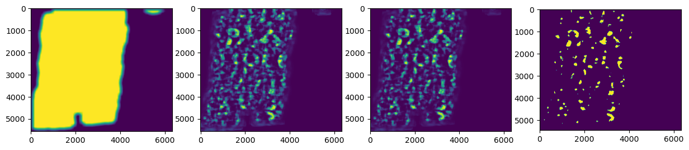
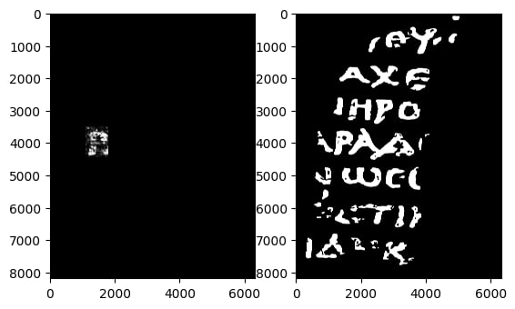

#   Vesuvius Challenge - Ink Detection 

This Skoltech Deep Learning Course 2023 final project "Ink detection of Herculaneum scrolls"

## Problem statement

The Kaggle competition hosts the Ink Detection Progress Prize ($100,000 in prizes) of Vesuvius challenge, which focuses on the sub-problem of detecting ink from 3d x-ray scans of fragments of papyrus (figure 2) which became detached from some of the excavated scrolls.
The goal is to detecting ink from 3D X-ray scans and reading the contents.
Due to the heat of the volcano, the scrolls were carbonized, and are now impossible to open without breaking them.
We will try to find the best model to get the maximum accuracy.

For kaggle data 3D X-ray scans (54keV) were transformed into “surface volumes” and then infrared photos were aligned with these surface volumes, and binary ink masks were created to denote the presence of ink

## Our results
At first we tried to use pretrained model that gave us f0.5 score equal to 0.26. As you can see, some letters might be seen in the result, however they are not perfectly readable:

Also, we tried using 3d convolutional neural network and we took the following approach: we trained the model on some subset of layers of the scan and checked the performace, so this was done to find suitable depth at which letters occur. Each time we predicted some letter and trained on everything except the letter. For the letter f0.5 score raised to 0.66:

As you can see, the letter is much more clearly seen. 
## Further improvement...

It would be great to separate the task on two steps: learn the model that soomehow predicts the depth the letters and the model that predicts letters themselves. Due to computational limits this task is not that easy. This approach also would perform better since we could use it on full dataset, and not only on one fragment.
Also, it is worth comparing different models such as Unet, Unet++, DeepLabV3+ and defining the optimal augmentations for our dataset.

## Installation

You can download this repo simply by cloning:

        git clone https://github.com/vladmd22/Incas

The data is given via the link:

        https://drive.google.com/drive/folders/1R8uubGEevPI9ao0tikSnQSt17e4LOtJv?usp=share_link
       
All dependencies are solved inside notebooks via !pip install.

## Team and responsibilities

+ Bari Khairullin : convnet code, repo
+ Yunseok Park : convnet code, presentation
+ Nikita Vasilev : both code files
+ Anastasia Gavrish : both code files
+ Vladislav Mityukov : repo, presentation
